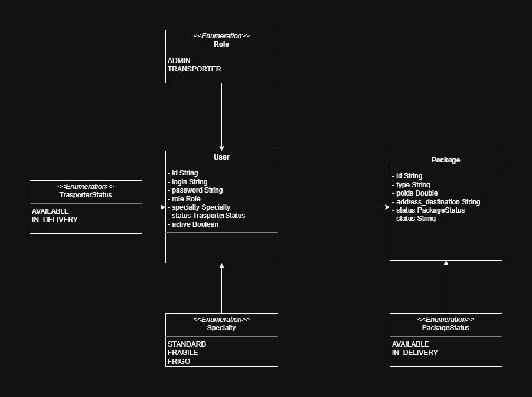
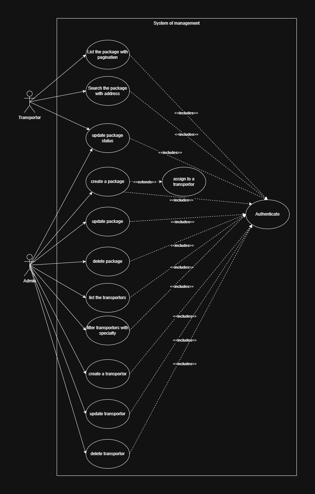
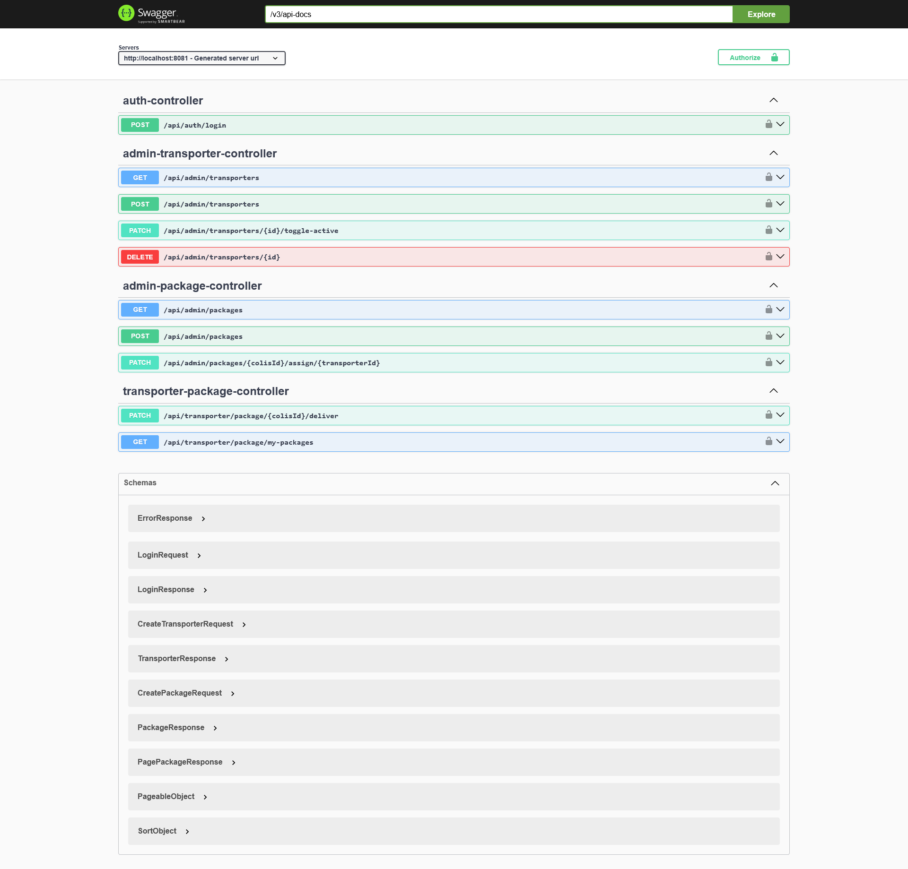
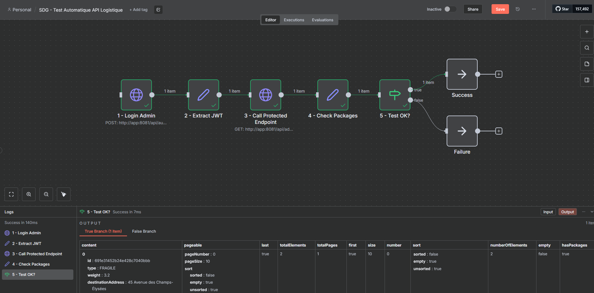

# Système de Gestion de Colis et Transporteurs (SDG)

## Project Description

**SDG** is a **modern, secure, and high-performance logistics management API** developed with **Spring Boot 3**, **Java 21**, and **MongoDB**, fully respecting the principles of **flexible schema**, **stateless security**, and **DevOps practices**.

This project enables intelligent management of parcels with **three distinct types** (Standard, Fragile, Refrigerated) using a **single flexible MongoDB collection**, as well as complete management of transporters and administrators — all secured by **JWT stateless authentication**.

**100% of required functionalities + Jenkins CI/CD + n8n automated testing bonus**

---

## Main Objectives

- Exploit MongoDB’s **flexible schema** (one `users` collection, one `colis` collection)
- Implement **stateless JWT authentication** with role-based access (ADMIN / TRANSPORTEUR)
- Manage parcels of **3 types** with conditional fields
- Ensure **specialty compatibility** when assigning a parcel to a transporter
- Offer **complete CRUD** with pagination, filters, and address search
- Guarantee **clean, testable, and maintainable architecture**
- Integrate **Docker**, **Jenkins CI/CD**, and **n8n automated testing** (bonus)

---

## Technologies Used

- **Java 21** & **Spring Boot 3.3.7**
- **Spring Data MongoDB** – Flexible NoSQL schema
- **Spring Security** + **JWT** (stateless)
- **MapStruct** – DTO ↔ Entity mapping
- **Lombok** – Clean and concise code
- **Spring Validation** + Custom exceptions
- **Global `@ControllerAdvice`** – Beautiful error handling
- **SpringDoc OpenAPI** – Swagger UI
- **JUnit 5 & Mockito** – Unit tests
- **Docker & Docker Compose** – Full containerization
- **Jenkins** – Enterprise CI/CD pipeline
- **n8n** – Automated API testing workflow (bonus)

---

## Key Features

**All required features implemented + bonuses**

| Feature                                    | Status | Role           |
|--------------------------------------------|--------|----------------|
| Flexible schema (1 collection `users`, 1 `colis`) | Done   |                |
| JWT stateless authentication               |성이   | ADMIN & TRANSPORTEUR |
| Create / List / Update / Delete parcels    | Done   | ADMIN          |
| Assign parcel → transporter (specialty check) | Done   | ADMIN          |
| Transporter sees & delivers his parcels    | Done   | TRANSPORTEUR   |
| Pagination + filters (type, status, address) | Done   | Both           |
| CRUD transporters (create, deactivate, delete) | Done   | ADMIN          |
| Account deactivation / reactivation        | Done   | ADMIN          |
| Clean error handling (`@ControllerAdvice`) | Done   |                |
| Swagger documentation                      | Done   |                |
| Docker + docker-compose (app + mongo + n8n) | Done   |                |
| Jenkins CI/CD (`Jenkinsfile`)              | Done   |                |
| n8n automated test workflow (bonus)        | Done   |                |

---

## Project Structure

```
    SDG/
    ├── src/
    │   └── main/java/com/logistics/sdg/
    │       ├── config/              → Security, OpenAPI, DataInitializer
    │       ├── controller/          → Admin & Transporter controllers
    │       ├── dto/                 → Request/Response records
    │       ├── exception/           → BusinessException + Global handler
    │       ├── mapper/              → MapStruct mappers
    │       ├── model/               → User, Package + enums
    │       ├── repository/          → MongoDB repositories
    │       ├── security/            → JWT filter & service
    │       ├── service/             → Business logic
    │       └── SdgApplication.java
    ├── docs/
    │   ├── Gestion_Des_Colis_Use_Case.png
    │   └── Gestion_Des_Colis.png
    ├── Dockerfile
    ├── docker-compose.yml           → app + mongo + n8n
    ├── Jenkinsfile                  → Full CI/CD pipeline
    ├── n8n.json                     → Importable automated test workflow
    ├── pom.xml
    └── README.md                    ← You are here
```

---

## Roles & Default Accounts

| Role          | Login       | Password   | Specialty |
|---------------|-------------|------------|-----------|
| **Admin**     | `admin`     | `admin` | —         |
| **Transporter** | `port`  | `port` | FRAGILE   |

→ Created automatically at startup

---

## Run the Project (2 methods)

### Method 1: Docker Compose (Recommended – 1 command)

```bash
# Clone the project
git clone https://github.com/YOUR_USERNAME/SDG.git
cd SDG

# Launch everything (MongoDB + API + n8n)
docker compose up -d --build
```

**Services available:**
- API → http://localhost:8080
- Swagger UI → http://localhost:8080/swagger-ui/index.html
- n8n (test automation) → http://localhost:5678

### Method 2: Local Development

```bash
# Start MongoDB locally or via Docker
docker run -d -p 27017:27017 --name sdg-mongo mongo:7.0

# Launch the Spring Boot app
./mvnw spring-boot:run
```

---

## Test the API

### 1. Login (get JWT)

```bash
    curl -X POST http://localhost:8080/api/auth/login \
      -H "Content-Type: application/json" \
      -d '{"login":"admin","password":"admin"}'
```

### 2. Create a FRAGILE parcel (ADMIN)

```bash
    curl -X POST http://localhost:8080/api/admin/colis \
      -H "Authorization: Bearer YOUR_JWT" \
      -H "Content-Type: application/json" \
      -d '{
        "type": "FRAGILE",
        "poids": 2.4,
        "adresseDestination": "12 Rue de la Paix, Paris",
        "instructionsManutention": "Ne pas empiler - Très fragile"
      }'
```

### 3. n8n Automated Test (Bonus)

1. Go to → http://localhost:5678
2. Import → `n8n.json` file from the project
3. Click **Execute Workflow** → **TEST RÉUSSI !**

---

## CI/CD with Jenkins

The project includes a complete `Jenkinsfile`:

```groovy
→ Build → Test → Package → Docker build → Deploy with docker-compose
```

Just create a **Pipeline** job in Jenkins and point to your Git repository → everything runs automatically.

---

## Screenshots

- Swagger UI with all endpoints
  
  
  
  
---